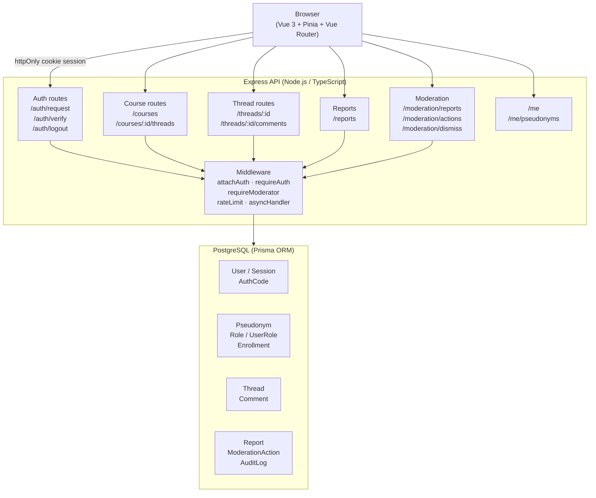

# AskU — System Architecture

## Overview

AskU is a three-tier web application. The browser talks to a REST API; the API reads and writes to a relational database. The components have no shared code and can be deployed independently.

```
┌─────────────────────────────────────────────────────────────┐
│                         User's browser                      │
│                                                             │
│   Vue 3 SPA  ─── HTTP/REST ───►  Express API  ──► PostgreSQL│
│   (port 80)                       (port 8000)   (port 5432) │
└─────────────────────────────────────────────────────────────┘
```

---

## Component diagram



---

## Request lifecycle

A typical authenticated request goes through the following steps:

1. **Browser** sends an HTTP request with the session cookie.
2. **`attachAuth` middleware** reads the cookie, hashes the token with SHA-256, and looks it up in the `Session` table. If found and not expired, it sets `req.user`.
3. **`requireAuth` middleware** (on protected routes) returns 401 if `req.user` is not set.
4. **Rate limiter** checks the per-user sliding-window bucket in memory. Returns 429 with `Retry-After` if the limit is exceeded.
5. **Route handler** runs inside `asyncHandler`, which catches any unhandled Promise rejection and forwards it to Express's error middleware (returns 500).
6. **Prisma** executes the database query.
7. **Response** is sent to the browser.

---

## Authentication flow

AskU uses email OTP (one-time password) login instead of passwords.

```
Browser                          API                         DB
  │                               │                           │
  │── POST /auth/request ────────►│                           │
  │   { email: "user@ut.ee" }     │── store AuthCode ────────►│
  │                               │   (hashed, 10 min TTL)    │
  │                               │── send 6-digit code ─────► SMTP
  │◄─ { ok: true } ───────────────│                           │
  │                               │                           │
  │── POST /auth/verify ─────────►│                           │
  │   { email, code }             │── validate code ─────────►│
  │                               │── create Session ────────►│
  │◄─ Set-Cookie: asku_session ───│   (hashed token, 14d)     │
  │                               │── delete AuthCode ───────►│
```

- The 6-digit code is generated with `crypto.randomInt` (cryptographically secure).
- Only the SHA-256 hash of the code is stored; the plaintext is never persisted.
- The session token is a 32-byte random value (`crypto.randomBytes`); only its hash is stored.

---

## Anonymity model

Each user gets a **per-course pseudonym** (e.g. `SwiftOwl342`) the first time they post in a course. The pseudonym is stored in the `Pseudonym` table, which links a real `userId` to a random public name for a specific course.

**What is visible to other users:**
- The pseudonym (`SwiftOwl342`)

**What is never exposed via the API:**
- The real email address
- The real user ID
- Links between pseudonyms across different courses

This means:
- Students can post anonymously without fear of identification.
- The platform can still enforce one-account-per-pseudonym integrity.
- Moderators can act on content without seeing real identities.

---

## Moderation flow

```
Student reports content
    │
    ▼
Report created (status: OPEN) → AuditLog entry
    │
    ▼
Moderator opens /moderation panel
    │
    ├── Hide content  → Thread/Comment.isHidden = true  → Report status: RESOLVED
    ├── Delete content → Thread/Comment deleted          → Report status: RESOLVED
    └── Dismiss        → no change to content           → Report status: REVIEWED
    │
    ▼
ModerationAction created → AuditLog entry
```

Every action is logged to `AuditLog` with the actor's user ID, entity type, entity ID, and a JSON metadata payload. This creates a complete audit trail for accountability.

---

## Rate limiting

All rate limits use an in-memory sliding-window algorithm (see `rateLimit.ts`).

| Action           | Window  | Limit | Key          |
|------------------|---------|-------|--------------|
| Auth request     | 1 hour  | 10    | per IP       |
| Auth verify      | 1 hour  | 30    | per IP       |
| Create thread    | 1 hour  | 3     | per user     |
| Create comment   | 1 hour  | 10    | per user     |
| Create report    | 1 hour  | 5 (prod) / 100 (dev) | per user |

Auth endpoints use IP-based keys (not user ID) because the user is not yet authenticated at that stage.

---

## Technology stack

| Layer     | Technology                          | Reason                                     |
|-----------|-------------------------------------|--------------------------------------------|
| Frontend  | Vue 3 + Composition API             | Reactive SPA, TypeScript-first             |
| State     | Pinia                               | Official Vue store, simple typed API       |
| Routing   | Vue Router 4                        | Nested routes, navigation guards           |
| Styling   | Tailwind CSS                        | Utility-first, no runtime overhead         |
| Build     | Vite (rolldown)                     | Fast dev server and production build       |
| Backend   | Node.js + Express 4                 | Widely used, lightweight REST framework    |
| Language  | TypeScript (strict mode)            | Type safety across the entire backend      |
| ORM       | Prisma                              | Type-safe DB queries, migration management |
| Database  | PostgreSQL 16                       | Relational integrity, UUID primary keys    |
| Container | Docker + Docker Compose             | Reproducible deployment                    |
| CI        | GitHub Actions                      | Automated typecheck and build on every push|
