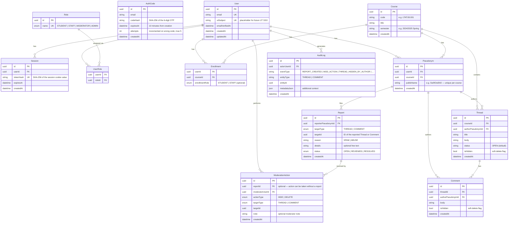

# AskU — Entity Relationship Diagram

The diagram below shows all database tables and their relationships.  
Generated from `apps/api/prisma/schema.prisma`.

---

## Key design decisions

### Pseudonym as the privacy boundary

The `Pseudonym` table is the core privacy mechanism. It acts as a proxy identity: a user's real `userId` is never stored on `Thread` or `Comment` — only their `authorPseudonymId`. This means:

- The API can return author display names (`publicName`) without ever leaking `userId` or `email`.
- A single user can participate in multiple courses under different pseudonyms, making cross-course linking impossible for other users.
- Moderators can act on content without seeing who the real author is.

### Polymorphic `targetId` in Report and ModerationAction

Both `Report.targetId` and `ModerationAction.targetId` are plain UUIDs paired with a `targetType` enum (`THREAD | COMMENT`). This is a deliberate simplification for the MVP — it avoids two separate foreign-key relations and keeps the schema flat.

The trade-off is that the database cannot enforce referential integrity on `targetId`. For the thesis scope this is acceptable, but a production system would use separate nullable foreign keys (`threadId`, `commentId`) or a polymorphic association pattern.

### Soft-delete vs hard-delete

`Thread.isHidden` and `Comment.isHidden` implement soft deletion. When a thread or comment is hidden by its author or a moderator, the row stays in the database so that:

- Audit logs remain consistent (they reference the entity ID).
- The content can potentially be restored by an admin.
- Statistics (report counts, etc.) remain accurate.

Moderator DELETE actions (`ModActionType.DELETE`) do perform a hard delete for the MVP. This will need revisiting before production.

### Session security

Sessions are implemented with a random 32-byte token stored in an `httpOnly` cookie (`SameSite=Lax`). Only the SHA-256 hash of the token is stored in the database. If the database were compromised, the attacker would still not have valid session tokens.
